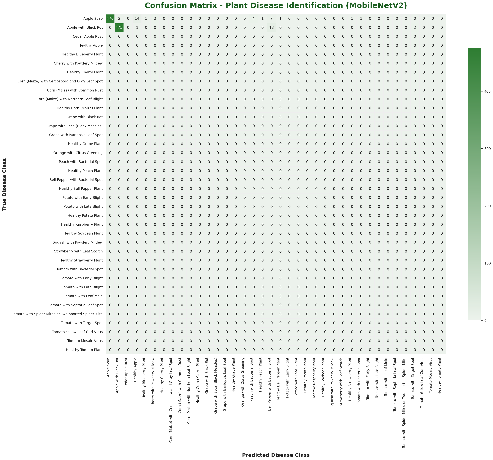

# AgriVision — Smart Agriculture Dashboard:

full-stack AI-powered dashboard that combines crop disease detection, live weather intelligence, mandi (market) price tracking, and government scheme discovery into a single, multilingual operational workspace for Indian farmers.

## Pipeline:
1. **Identify the disease** using a pre-trained MobileNetV2 deep learning model.
2. **Generate actionable recommendations** (e.g. fungicide advice, watering tips).
3. **Blend live weather data** from the Agromonitoring API for the selected farm location.
4. **Pull real-time mandi prices** from the Government of India's Open Data API.
5. **Save every advisory** to MongoDB so farmers can review historical reports.

The entire dashboard is available in **English, Hindi, and Marathi**.

## Features

| Module | Description |
|---|---|
| **🔬 Disease Detection** | Upload a crop leaf image → AI classifies the disease → actionable recommendation generated |
| **🌤️ Weather Intelligence** | Real-time weather + 5-day forecast for any Indian city via Agromonitoring API |
| **📊 Mandi Prices** | Live commodity prices from `data.gov.in` with state/district/commodity filters |
| **🏛️ Government Schemes** | Searchable database of agricultural subsidies and support programs |
| **📜 Advisory History** | MongoDB-backed history of all past analyses with timestamps |
| **🌐 Multilingual UI** | Full i18n support for English, Hindi, and Marathi — switchable with one click |
| **🐳 Docker Ready** | Single `docker compose` command to spin up the full stack |
## 🏗️ Architecture

```
┌───────────────────────────────────────────────────────────┐
│                      Browser (Client)                     │
│  index.html + styles.css + app.js  (vanilla HTML/CSS/JS)  │
└──────────────────────────┬────────────────────────────────┘
                           │  HTTP (port 5000)
┌──────────────────────────▼────────────────────────────────┐
│                    Flask Backend (app.py)                  │
│                                                           │
│  ┌─────────────┐  ┌──────────────┐  ┌─────────────────┐  │
│  │ /predict     │  │ /agri/*      │  │ /locations/*    │  │
│  │ Disease      │  │ Advisory     │  │ States & Cities │  │
│  │ Detection    │  │ Weather      │  │                 │  │
│  └──────┬──────┘  │ Market Prices │  └─────────────────┘  │
│         │         │ Soil Data     │                        │
│         ▼         └──────┬───────┘                        │
│  ┌─────────────┐         │                                │
│  │ HuggingFace │         ▼                                │
│  │ MobileNetV2 │  ┌─────────────┐  ┌──────────────────┐  │
│  │ (PyTorch)   │  │ Agro-       │  │ data.gov.in      │  │
│  └─────────────┘  │ monitoring  │  │ Mandi API        │  │
│                   │ API         │  └──────────────────┘  │
│                   └─────────────┘                        │
│                          │                                │
│                   ┌──────▼──────┐                         │
│                   │  MongoDB    │                         │
│                   │  (history)  │                         │
│                   └─────────────┘                         │
└───────────────────────────────────────────────────────────┘
```
##  Setup:

### Prerequisites

- **Python 3.10+**
- **MongoDB** (local install or Docker)
- API keys for:
  - [Agromonitoring](https://agromonitoring.com/) (free tier available)
  - [data.gov.in](https://data.gov.in/) (free API key)
## Model: 
`linkanjarad/mobilenet_v2_1.0_224-plant-disease-identification` (HuggingFace Hub)
- **Input**: Any crop leaf image (JPEG/PNG)
- **Output**: Disease label + confidence score + treatment recommendation
- **Recommendation engine**: Rule-based matching on disease keywords (blight, rust, healthy, etc.)
- **No training required** — the model is pre-trained and auto-downloaded on first run.
####  Global Evaluation Metrics

| Metric | Score | Description |
| :--- | :--- | :--- |
| **Accuracy** | **93.68%** | Fraction of correctly classified leaf images across all 38 classes |
| **Weighted F1-Score** | **93.56%** | Balanced harmonic mean of precision & recall weighted by class size |
| **Macro F1-Score** | **93.56%** | Unweighted average of F1-scores across all 38 distinct categories |
| **Macro Precision** | **94.35%** | Average precision across all classes (minimizing false positives) |
| **Macro Recall** | **93.68%** | Average recall across all classes (minimizing false negatives) |

#### 🗺️ Confusion Matrix Heatmap

Below is the high-resolution, professional forest green confusion matrix generated for the 38 plant disease classes. It demonstrates the model's outstanding capability to classify diseases with minimal cross-class confusion:




##  Future Improvements

- [ ] **User Authentication** — Add login/signup with JWT for personalized dashboards
- [ ] **Image History** — Store uploaded leaf images alongside predictions in MongoDB/S3
- [ ] **Model Upgrade** — Fine-tune on a larger plant disease dataset (PlantVillage 54-class)
- [ ] **Push Notifications** — Alert farmers about disease outbreaks in their region
- [ ] **Mobile App** — React Native companion app with camera integration
- [ ] **Voice Input** — Support voice-based queries in Hindi/Marathi for low-literacy users
- [ ] **Offline Mode** — Cache recent advisories and schemes for areas with poor connectivity
- [ ] **Analytics Dashboard** — Aggregate disease trends by region and season
- [ ] **Multi-crop Support** — Expand recommendation engine beyond blight/rust/healthy
- [ ] **CI/CD Pipeline** — GitHub Actions for automated testing and Docker image builds
